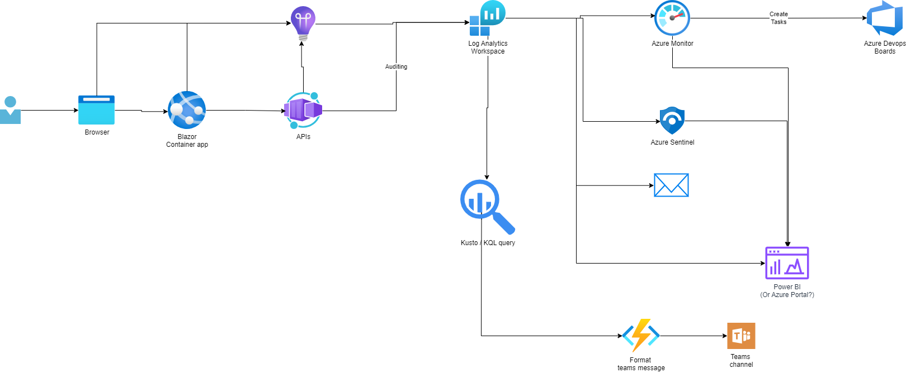

# AzureFest2024

11 September 2024.

## Syllabus

In this session, I will demonstrate how to `generate and store monitoring and analytics data` for your `containerized application in Azure`, `turn that data into actionable information` , and `act on that information by setting up a durable integration with Azure DevOps` to inform your planning and optimize the value of new development.

By now, the DevOps lifecycle is a well-known and reasonably understood theoretical framework. Your team should strive to achieve the `"7Cs"` whenever feasible. The DevOps mindset has been applied to other fields, resulting in DevSecOps, DataOps, AIOps, and MLOps, collectively known as XOps.

So, the theory is sound. But to actually accomplish this in practice, with an actual application, is another challenge altogether. Based on a real DevOps implementation journey, I will share how I implemented the "C" of the 7Cs that is often lacking even in mature DevOps cycles: `Continuous Monitoring`. I will also disclose where I went wrong and how to further improve upon what I delivered in the end.

What can you expect? As you are probably aware, Azure has plenty of services that can help us set up and professionalize the monitoring process. As an obedient DevOps disciple, I started with a containerized application using Azure Container Apps. I will show how to gather data using `Azure Monitor` and `Azure Sentinel`, set effective alerts based on pre-determined, smart triggers to turn that data into actionable information, and use `Action Groups and Functions to create and update items on an Azure DevOps board` (or other ALM tooling). Adding more customization using `KQL for custom queries` of the telemetry and creating `dashboards in Azure DevOps` that connect back to all that monitoring using `Power BI` will also be on the program. And finally, the cherry on top: `integrating with Microsoft Outlook and Microsoft Teams` to fully automate the jump from monitoring and operations to planning.

After this session, you will have plenty of inspiration and examples of using monitoring, analytics, and telemetry to build higher-quality and more secure cloud applications. If you want to ensure you can keep building quality software, make sure you join me and learn how to automate as much of the monitoring process as possible!

## The talk

- [The talk](https://www.azurefest.nl/2024/session/achieving-continuous-monitoring-by-integrating-azure-and-azure-devops)
- [The repo](https://github.com/JelleFremery/AzureFest2024.git)

## Core elements

- Generate and store monitoring and analytics data
  - App insights (Client? and Server side)
  - Log Analytics workspace
  - Azure monitor? -> **koppeling Azure DevOps work items** MS Learn.
  - Azure Sentinel?
  - Auditing on all resources.
- Turn that data into actionable information
- Act on that information by setting up a durable integration with Azure DevOps
- Containerized Application in Azure
  - Welke functionaliteit om redelijke data te krijgen?
    - Login?
    - Data(base) access?
    - [.NET eShop](https://github.com/dotnet/eShop)?
- [7 Cs of DevOps](https://www.geeksforgeeks.org/devops-lifecycle/)
- Continuous Monitoring
- Azure Monitor
  - Nog nooit ingericht...
- Azure Sentinel + Azure Monitor.
  - Global resources. Hulp nodig om aan te maken.
- Action Groups and Functions create and update items on an Azure DevOps
  - Voorbeeld Function beschikbaar?
- KQL for custom queries (event count voorbeeld)
- Dashboards in Power BI in Azure DevOps
- Integrating with Microsoft Outlook and Microsoft Teams
  - Default / custom (vooral teams)

| Resource | Purpose |
| --- | --- |
| [Betabit-AzureFest](https://portal.azure.com/?feature.tokencaching=true&feature.internalgraphapiversion=true#@betabitextranet.onmicrosoft.com/resource/subscriptions/0c714ab2-4eb7-414f-8b6d-9acf76aa80ca/resourceGroups/Betabit-AzureFest/overview) | Resource group where allmost all related resoruces are grouped. |
| [Betabit-AzureFest-loganalytics](https://portal.azure.com/#@betabitextranet.onmicrosoft.com/resource/subscriptions/0c714ab2-4eb7-414f-8b6d-9acf76aa80ca/resourceGroups/Betabit-AzureFest/providers/Microsoft.OperationalInsights/workspaces/Betabit-AzureFest-loganalytics) | Log analytics workspace |
| [Betabit-AzureFest-ai](https://portal.azure.com/#@betabitextranet.onmicrosoft.com/resource/subscriptions/0c714ab2-4eb7-414f-8b6d-9acf76aa80ca/resourceGroups/Betabit-AzureFest/providers/microsoft.insights/components/Betabit-AzureFest-ai) | App insights to collect logs from the container apps. |
| [BetabitAzureFestAcr](https://portal.azure.com/#@betabitextranet.onmicrosoft.com/resource/subscriptions/0c714ab2-4eb7-414f-8b6d-9acf76aa80ca/resourceGroups/Betabit-AzureFest/providers/Microsoft.ContainerRegistry/registries/BetabitAzureFestAcr) | Azure Container Registry |
| [SecurityInsights(betabit-azurefest-loganalytics)](https://portal.azure.com/#@betabitextranet.onmicrosoft.com/resource/subscriptions/0c714ab2-4eb7-414f-8b6d-9acf76aa80ca/resourceGroups/betabit-azurefest/providers/Microsoft.OperationsManagement/solutions/SecurityInsights(betabit-azurefest-loganalytics)) | Microsoft.OperationsManagement/solutions |
| [Betabit-AzureFest-cae](https://portal.azure.com/#@betabitextranet.onmicrosoft.com/resource/subscriptions/0c714ab2-4eb7-414f-8b6d-9acf76aa80ca/resourceGroups/Betabit-AzureFest/providers/Microsoft.App/managedEnvironments/Betabit-AzureFest-cae) | Container application environment. Hosts the container apps. |
| [Betabit-AzureFest-mi](https://portal.azure.com/#@betabitextranet.onmicrosoft.com/resource/subscriptions/0c714ab2-4eb7-414f-8b6d-9acf76aa80ca/resourceGroups/Betabit-AzureFest/providers/Microsoft.ManagedIdentity/userAssignedIdentities/Betabit-AzureFest-mi) | User assigned Identity, for instance used to allow the container app to pull from the ACR. |
| [cache](https://portal.azure.com/#@betabitextranet.onmicrosoft.com/resource/subscriptions/0c714ab2-4eb7-414f-8b6d-9acf76aa80ca/resourceGroups/Betabit-AzureFest/providers/Microsoft.App/containerApps/cache) | Azure container app with Redis cache to cache the requests to the weather API. |
| [apiservice](https://portal.azure.com/#@betabitextranet.onmicrosoft.com/resource/subscriptions/0c714ab2-4eb7-414f-8b6d-9acf76aa80ca/resourceGroups/Betabit-AzureFest/providers/Microsoft.App/containerApps/apiservice) | Azure container app with API to provide (generated) weather information. |
| [webfrontend](https://portal.azure.com/#@betabitextranet.onmicrosoft.com/resource/subscriptions/0c714ab2-4eb7-414f-8b6d-9acf76aa80ca/resourceGroups/Betabit-AzureFest/providers/Microsoft.App/containerApps/webfrontend) | Azure container app with Blazor web app to provide weather information. |
| [allerttoteams](https://portal.azure.com/#@betabitextranet.onmicrosoft.com/resource/subscriptions/0c714ab2-4eb7-414f-8b6d-9acf76aa80ca/resourceGroups/Betabit-AzureFest/providers/Microsoft.App/containerApps/allerttoteams) | Azure container app with Azure function to translate the common alert message to a dynamic message for Teams and send it to teams. Changes the message depending on the incoming alert type. Adds buttons to the message to make it actionable. |
| [Betabit-AzureFest-ToTeams](https://portal.azure.com/#@betabitextranet.onmicrosoft.com/resource/subscriptions/0c714ab2-4eb7-414f-8b6d-9acf76aa80ca/resourceGroups/Betabit-AzureFest/providers/microsoft.insights/actiongroups/Betabit-AzureFest-ToTeams) | Action group to send alerts to Teams. Also sends alerts to Request Inspector to be able to inspect the messages. |
| [Betabit-AzureFest-ToMail](https://portal.azure.com/#@betabitextranet.onmicrosoft.com/resource/subscriptions/0c714ab2-4eb7-414f-8b6d-9acf76aa80ca/resourceGroups/Betabit-AzureFest/providers/microsoft.insights/actiongroups/Betabit-AzureFest-ToMail) | Action group to send alerts to e-mail. |
| [Betabit-Azurefest-Weather](https://portal.azure.com/#@betabitextranet.onmicrosoft.com/resource/subscriptions/0c714ab2-4eb7-414f-8b6d-9acf76aa80ca/resourceGroups/Betabit-AzureFest/providers/microsoft.insights/scheduledqueryrules/Betabit-Azurefest-Weather) | Alert that, once every 5 minutes, checks there have not been more than 20 requests to the app in that time span. Alert uses the two action groups to send the alert to the right places. |
| [Betabit-Azurefest-Exceptions](https://portal.azure.com/#@betabitextranet.onmicrosoft.com/resource/subscriptions/0c714ab2-4eb7-414f-8b6d-9acf76aa80ca/resourceGroups/Betabit-AzureFest/providers/microsoft.insights/scheduledqueryrules/Betabit-Azurefest-Exceptions) | Alert that, once every minute, checks there have not been any 'too cold' exceptions in the API in that time span. Alert uses the two action groups to send the alert to the right places. |
| [Monitor](https://portal.azure.com/#view/Microsoft_Azure_Monitoring/AzureMonitoringBrowseBlade/) | Azure monitor instances. |
| [Betabit-AzureFest-loganalytics](https://portal.azure.com/#view/Microsoft_Azure_Security_Insights/MainMenuBlade/~/0/id/%2Fsubscriptions%2F0c714ab2-4eb7-414f-8b6d-9acf76aa80ca%2Fresourcegroups%2Fbetabit-azurefest%2Fproviders%2Fmicrosoft.securityinsightsarg%2Fsentinel%2Fbetabit-azurefest-loganalytics) | Azure Sentinel instance. |

### Containerized application in Azure

- [.NET Aspire](https://learn.microsoft.com/en-us/dotnet/aspire/)
- [Azure container apps](https://azure.microsoft.com/en-us/products/container-apps)
- [Deploy apps to Azure Container Apps easily with .NET Aspire](https://techcommunity.microsoft.com/t5/apps-on-azure-blog/deploy-apps-to-azure-container-apps-easily-with-net-aspire/ba-p/4032711)
- [Deploy a .NET Aspire project to Azure Container Apps](https://learn.microsoft.com/en-us/dotnet/aspire/deployment/azure/aca-deployment?tabs=visual-studio%2Clinux%2Cpowershell&pivots=azure-azd)

## Related Betatalks

- [Betatalks #97 - Microsoft Azure Sentinel](https://www.betabit.nl/betatalks-videos/betatalks-97-microsoft-azure-sentinel)
- [Betatalks #91 - Early impressions of .NET Aspire: Cloud-first development](https://www.betabit.nl/betatalks-videos/betatalks-91-early-impressions-of-net-aspire-cloud-first-development)

## Slightly related Betatalks

- [Betatalks #95 - .NET Essentials: Logging in .NET (Part 1)](https://www.betabit.nl/betatalks-videos/betatalks-95-net-essentials-logging-in-net-part-1)
- [Betatalks #96 - .NET Essentials: Logging in .NET (Part 2)](https://www.betabit.nl/betatalks-videos/betatalks-96-net-essentials-logging-in-net-part-2)

## Demo project

The example is taken from  [Deploy apps to Azure Container Apps easily with .NET Aspire](https://techcommunity.microsoft.com/t5/apps-on-azure-blog/deploy-apps-to-azure-container-apps-easily-with-net-aspire/ba-p/4032711) to create an Aspire app. The project is added to the `DemoApp` folder of this solution.

Install:

- [Aspire](https://learn.microsoft.com/en-us/dotnet/aspire/fundamentals/setup-tooling)
- [Aspir8](https://github.com/prom3theu5/aspirational-manifests)
- [Azure CLI](https://learn.microsoft.com/en-us/cli/azure/)

To build the docker images, store them in AzUre Container Registry and deploy them as Azure Container apps, run the `DeployTo-Azure.ps1` script in the root of this repository.
